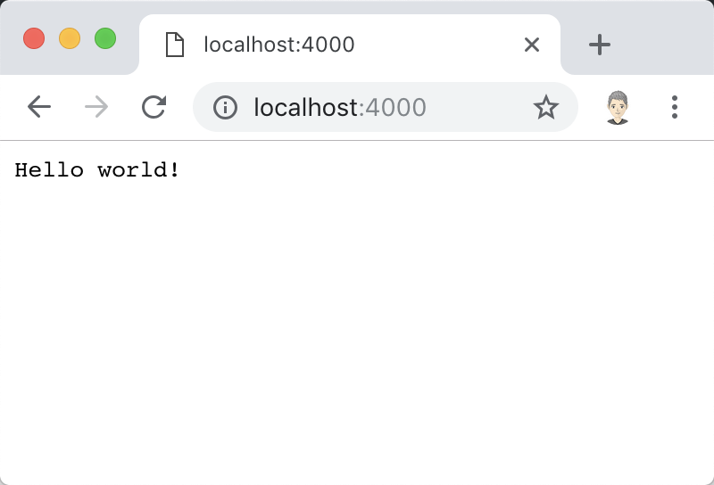

# 第 01 课：初窥 HTTP 服务器

想要学习 Go 语言的 Web 开发，就必须知道如何在 Go 语言中启动一个 HTTP 服务器用于接受和响应来自客户端的 HTTP 请求。虽然 Web 应用协议不止于 HTTP（HyperText Transfer Protocol），还包括常见的 Socket、WebSocket 和 SPDY 等等，但 HTTP 是当下最简单和最常见的交互形式。与其它语言所不同的是，Go 语言的标准库自带了一系列结构和方法来帮助开发者简化 HTTP 服务开发的相关流程。因此，我们不需要依赖任何第三方组件就能构建并启动一个高并发的 HTTP 服务器。

## Hello world!

第一步，就让我们使用 Go 语言来搭建一个 HTTP 版的 ”Hello world“ 程序吧！

我们先创建一个名为 `http_server.go` 的文件，然后输入以下代码（_示例文件 [http_server.go](../listings/01/http_server.go)_）：

```go
package main

import (
	"log"
	"net/http"
)

func main() {
	http.HandleFunc("/", func(w http.ResponseWriter, r *http.Request) {
		w.Write([]byte("Hello world!"))
	})

	log.Println("Starting HTTP server...")
	log.Fatal(http.ListenAndServe("localhost:4000", nil))
}
```

当我们通过终端运行这段代码的时候，就能够看到如下输出：

```
➜ go run http_server.go
2018/11/25 07:34:49 Starting HTTP server...
```

此时，我们的 HTTP 服务器已经监听在本机的 4000 端口，并准备好接受来自客户端的请求了。有两种方式可以验证这个小程序的正确性：终端调用 cURL 或者打开浏览器访问。

调用 cURL 的命令非常简单，回车运行之后即可看到服务端响应的字符串 ”Hello world!“：

```
➜ curl http://localhost:4000
Hello world!
```

同样的，如果直接打开浏览器访问地址 http://localhost:4000 的话，我们也可以看到一样的字符串：



是不是感觉几个简单的步骤就实现了一个完全可用的 HTTP 服务器？这就是 Go 语言的魅力之一！

接下来，让我们分析一下这段代码具体都做了什么事情。

我们需要明白这里有三个关键点：

1. [`http.HandleFunc`](https://gowalker.org/net/http#HandleFunc) 函数的作用是将某一个函数与一个路由规则进行绑定，当用户访问指定路由时（某个路由规则匹配成功），所绑定的函数就会被执行。它接受两个参数，第一个参数就是指定的路由规则，本例中我们使用 `/` 来表示根路径；第二个参数就是与该路由进行绑定的函数。
2.  [`http.HandleFunc`](https://gowalker.org/net/http#HandleFunc) 的第二个参数必须符合函数签名 `func(http.ResponseWriter, *http.Request)`，这个函数同样接受两个参数，第一个参数是请求所对应的响应对象 [`http.ResponseWriter`](https://gowalker.org/net/http#ResponseWriter)，包括响应码（Response Code）、响应头（Response Header）和响应体（Response Body）等等，我们就是通过调用这个对象的 `Write` 方法向响应体写入 ”Hello world!“ 字符串的；第二个参数则是请求所对应的请求对象 [`*http.Request`](https://gowalker.org/net/http#Request)，该对象包含当前这个 HTTP 请求所有的信息，包括请求头（Request Header）、请求体（Request Body）和其它相关的内容。
3.  [`http.ListenAndServe`](https://gowalker.org/net/http#ListenAndServe) 函数的作用就是启动 HTTP 服务器，并监听发送到指定地址和端口号的 HTTP 请求，本例中我们要求 HTTP 服务器监听并接受发送到地址 localhost 且端口号为 4000 的 HTTP 请求。这个函数也接受两个参数，我们目前只使用到了第一个参数，即监听地址和端口号；第二个参数会在后文讲解，因此暂时可以使用 nil 作为它的值。另外，如果监听地址为 127.0.0.1 或者 localhost，则可以使用更加简洁的写法，即 `http.ListenAndServe(":4000", nil) `。

除此之外，你可能已经注意到为了节省代码行数，我们在这段代码中使用了匿名函数来编写 HTTP 请求的处理逻辑。这在编写简单的逻辑时非常方便，但当逻辑处理较为复杂时，应该定义一个独立的函数以提升代码的可读性。我们可以将这段代码等价地转化为如下形式（_示例文件 [http_server_2.go](../listings/01/http_server_2.go)_）：

```go
package main

import (
	"log"
	"net/http"
)

func main() {
	http.HandleFunc("/", hello)

	log.Println("Starting HTTP server...")
	log.Fatal(http.ListenAndServe(":4000", nil))
}

func hello(w http.ResponseWriter, r *http.Request) {
	w.Write([]byte("Hello world!"))
}
```

重新运行这段代码在输出结果上并没有任何不同，只是代码结构稍稍改变了。

实际上，`http.HandleFunc` 也是标准库提供给用户的一种简便写法，它的第二个参数的函数签名必须为 `func(http.ResponseWriter, *http.Request)` 是因为在 `http.HandleFunc` 函数内部会将我们传入的绑定函数转化为类型 [`http.HandlerFunc`](https://gowalker.org/net/http#HandlerFunc)，即一个 Go 语言中标准的 HTTP 请求处理器对象，这个对象类型实现了 [`http.Handler`](https://gowalker.org/net/http#Handler) 接口：

```go
type Handler interface {
    ServeHTTP(ResponseWriter, *Request)
}
```

通过 `http.Handler` 的接口定义我们发现，函数签名 `func(http.ResponseWriter, *http.Request)` 的由来是因为要实现接口的 `ServeHTTP` 方法。

现在我们知道了 `http.HandleFunc` 的根本作用是将一个函数转化为一个实现了 `http.Handler` 接口的类型（`http.HandlerFunc`），那么我们可不可以自己创建一个类型并实现 `http.Handler` 接口呢？答案当然是肯定的。

一模一样的功能，下面的代码使用了更加复杂的用法（_示例文件 [http_server_3.go](../listings/01/http_server_3.go)_）：

```go
package main

import (
	"log"
	"net/http"
)

func main() {
	http.Handle("/", &helloHandler{})

	log.Println("Starting HTTP server...")
	log.Fatal(http.ListenAndServe(":4000", nil))
}

type helloHandler struct{}

func (*helloHandler) ServeHTTP(w http.ResponseWriter, r *http.Request) {
	w.Write([]byte("Hello world!"))
}
```

这段代码不再使用 `http.HandleFunc` 函数，取而代之的是直接调用 [`http.Handle`](https://gowalker.org/net/http#Handle) 并传入我们自定义的 `http.Handler` 实现。

初学者有一点需要特别注意，即 Go 语言是一门大小写敏感的语言（否则无法通过首字母大小写区分一个对象是公开的还是私有的）。因此，想要实现`http.Handler` 接口，方法名称必须连大小写也保持一致，即这里的方法名称必须是 `ServeHTTP` 而不可以是 `ServeHttp`。

## 服务复用器（ServeMux）

好奇的你可能会问，前文中 `http.ListenAndServe(":4000", nil)` 用 nil 代替的到底是一个东西？Go 语言标准库的设计非常精妙，不可能平白无故地提供给我们一个没有用处的参数。

根据 `http.ListenAndServe` 的函数声明可以得知，这里的 nil 代替的其实是一个实现了 `http.Handler` 接口的对象：

```go
func ListenAndServe(addr string, handler Handler) error {...}
```

是不是有点眼熟？因为这说明我们之前的定义的 `helloHandler` 就可以被用作这里的参数（_示例文件 [http_server_4.go](../listings/01/http_server_4.go)_）：

```go
package main

import (
	"log"
	"net/http"
)

func main() {
	log.Println("Starting HTTP server...")
	log.Fatal(http.ListenAndServe("localhost:4000", &helloHandler{}))
}

type helloHandler struct{}

func (*helloHandler) ServeHTTP(w http.ResponseWriter, r *http.Request) {
	w.Write([]byte("Hello world!"))
}
```

运行这段代码同样可以得到和之前一模一样的结果！

不过，在实际开发中很少直接将一个纯粹的处理器（Handler）作为这里的参数，因为它缺失了一个非常重要的功能，它不能像之前调用 `http.HandleFunc` 或 `http.Handle` 那样方便地将路由规则和执行函数进行绑定。

通过查看 `http.Handle` 源码可以得知，它其实是对一个默认的 [`http.ServeMux`](https://gowalker.org/net/http#ServeMux) 对象（`http.DefaultServeMux`）进行了一层封装：

```go
func Handle(pattern string, handler Handler) {
    DefaultServeMux.Handle(pattern, handler)
}
```

这个 `http.ServeMux` 的作用是什么呢？它就是 Go 语言标准库实现的一个带有基本路由功能的服务复用器（Multiplexer）。除了可以通过 `http.HandleFunc` 或 `http.Handle`  这类方法操作 `http.DefaultServeMux` 对象之外，我们也可以通过标准库提供的方法 [`http.NewServeMux`](https://gowalker.org/net/http#NewServeMux) 来创建一个新的 `http.ServeMux` 对象（_示例文件 [http_server_5.go](../listings/01/http_server_5.go)_）：

```go
package main

import (
	"log"
	"net/http"
)

func main() {
	mux := http.NewServeMux()
	mux.Handle("/", &helloHandler{})
	log.Println("Starting HTTP server...")
	log.Fatal(http.ListenAndServe("localhost:4000", mux))
}

type helloHandler struct{}

func (*helloHandler) ServeHTTP(w http.ResponseWriter, r *http.Request) {
	w.Write([]byte("Hello world!"))
}
```

你可能已经猜到，这段代码依旧和之前做的是一模一样的事情。不过做到这个程度，便是大多数 Web 框架的底层用法了。它们本质上就是一个带有路由层的 `http.Handler` 具体实现，并以此为基础提供大量便利的辅助方法。

## 服务器对象（Server）

既然 `http.HandleFunc` 和 `http.Handle` 都是对一个默认对象 `http.DefaultServeMux` 的封装，那 `http.ListenAndServe` 是否也是如此？我们可以从它的源码中找到答案：

```go
func ListenAndServe(addr string, handler Handler) error {
    server := &Server{Addr: addr, Handler: handler}
    return server.ListenAndServe()
}
```

显而易见，虽然不是针对某个全局对象的封装，但也同样是在调用的时候创建了另一个 [`http.Server`](https://gowalker.org/net/http#Server) 的对象。相比较而言，`http.Server` 的自定义程度就非常高了，它包含了 Go 语言标准库提供的所有可能的选项，包括监听地址、服务复用器和读写超时等等。

接下来，让我们使用 `http.Server` 对象来改写一下我们的小程序（_示例文件 [http_server_6.go](../listings/01/http_server_6.go)_）：

```go
package main

import (
	"log"
	"net/http"
)

func main() {
	mux := http.NewServeMux()
	mux.Handle("/", &helloHandler{})

	server := &http.Server{
		Addr:    ":4000",
		Handler: mux,
	}
	log.Println("Starting HTTP server...")
	log.Fatal(server.ListenAndServe())
}

type helloHandler struct{}

func (*helloHandler) ServeHTTP(w http.ResponseWriter, r *http.Request) {
	w.Write([]byte("Hello world!"))
}
```

如果只是单纯地将标准库的封装强行抽离出来未免显得有点小题大做，那么我们可以对这个自定义的 `http.Server` 对象做点什么事情呢？不如就设置一个写超时（Write Timeout）好啦。写超时包含的范围是当请求头被解析后直到响应完成，浅显一点的理解就是从我们绑定的函数开始执行到执行结束为止，如果这个时间范围超过定义的周期则会触发写超时。

_示例文件 [http_server_7.go](../listings/01/http_server_7.go)_

```go
package main

import (
	"log"
	"net/http"
	"time"
)

func main() {
	mux := http.NewServeMux()
	mux.Handle("/", &helloHandler{})
	mux.HandleFunc("/timeout", func(w http.ResponseWriter, r *http.Request) {
		time.Sleep(2 * time.Second)
		w.Write([]byte("Timeout"))
	})

	server := &http.Server{
		Addr:         ":4000",
		Handler:      mux,
		WriteTimeout: 2 * time.Second,
	}
	log.Println("Starting HTTP server...")
	log.Fatal(server.ListenAndServe())
}

type helloHandler struct{}

func (*helloHandler) ServeHTTP(w http.ResponseWriter, r *http.Request) {
	w.Write([]byte("Hello world!"))
}
```

在这段代码里，我们添加了对 `WriteTimeout` 字段的赋值，设为 2 秒钟，同时添加了一个新的执行函数用于先休眠 2 秒然后向客户端输出 ”Timeout“ 字符串。

启动服务器后，如果我们访问 http://localhost:4000 会收到和之前一样的结果，但如果尝试访问 http://localhost:4000/timeout 则不会收到任何消息：

```
➜ curl http://localhost:4000/timeout
curl: (52) Empty reply from server
```

这是因为我们的执行函数在休眠 2 秒后被 `http.Server` 对象认为已经超时，提前关闭了与客户端之间的连接，因此无论执行函数后面向响应体写入任何东西都不会有任何作用。

部分 Web 框架使用的便是自定义的 `http.Server` 对象，因此你只能通过调用框架提供的特定方法来启动服务。

## 优雅地停止服务

在产生环境中，许多开发者面临的一个困难就是当需要更新服务端程序时需要重启服务，但此时可能有一部分请求进行到一半，如果强行中断这些请求可能会导致意外的结果。因此，开源社区提供了多种优雅停止的方案，像 [facebookgo/grace](https://github.com/facebookgo/grace) 就是其中的代表作之一。不过从 Go 1.8 版本开始，标准库终于支持原生的优雅停止方案了。

这种方案同样要求用户创建自定义的 `http.Server` 对象，因为对应的 [`Shutdown`](https://gowalker.org/net/http#Server_Shutdown) 方法无法通过其它途径调用。

我们来看下面的代码，这段代码通过结合捕捉系统信号（Signal）、goroutine 和管道（Channel）来实现服务器的优雅停止（_示例文件 [http_server_8.go](../listings/01/http_server_8.go)_）：

```go
package main

import (
	"context"
	"log"
	"net/http"
	"os"
	"os/signal"
)

func main() {
	mux := http.NewServeMux()
	mux.Handle("/", &helloHandler{})

	server := &http.Server{
		Addr:    ":4000",
		Handler: mux,
	}

	// 创建系统信号接收器
	quit := make(chan os.Signal)
	signal.Notify(quit, os.Interrupt)
	go func() {
		<-quit

		if err := server.Shutdown(context.Background()); err != nil {
			log.Fatal("Shutdown server:", err)
		}
	}()

	log.Println("Starting HTTP server...")
	err := server.ListenAndServe()
	if err != nil {
		if err == http.ErrServerClosed {
			log.Print("Server closed under request")
		} else {
			log.Fatal("Server closed unexpected")
		}
	}
}

type helloHandler struct{}

func (*helloHandler) ServeHTTP(w http.ResponseWriter, r *http.Request) {
	w.Write([]byte("Hello world!"))
}
```

这段代码通过捕捉 `os.Interrupt` 信号（Ctrl+C）然后调用 `server.Shutdown` 方法告知服务器应停止接受新的请求并在处理完当前已接受的请求后关闭服务器。为了与普通错误相区别，标准库提供了一个特定的错误类型 `http.ErrServerClosed`，我们可以在代码中通过判断是否为该错误类型来确定服务器是正常关闭的还是意外关闭的。

如果我们运行程序后按下 Ctrl+C 便可以看到如下输出：

```
➜ go run http_server.go
2018/11/25 10:23:28 Starting HTTP server...
^C2018/11/25 10:23:30 Server closed under request
```

是不是很酷？

## 小结

这节课，我们通过编写 HTTP 服务器的 N 种写法由浅入深地学习了如何在 Go 语言中建立一个 HTTP 服务器，并了解了它们之间的相同和不同之处。相信此时的同学们已经能够对 Go 语言的 HTTP 服务器有一定程度的认识，并可以自如地运用到实际开发中了。

下节课，我们将在 HTTP 服务器的基础上，学习如何使用 Go 语言提供的模板引擎。

---

接下来：[第 02 课：基础模板用法](02.md)
