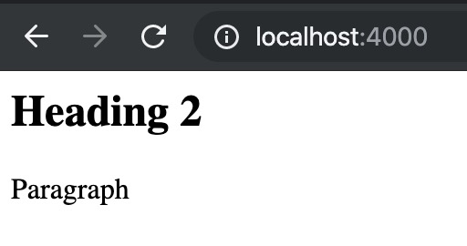
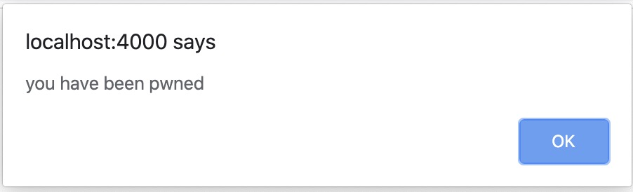
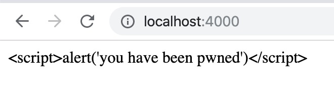
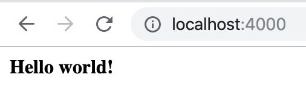
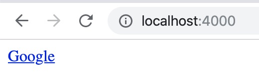

# 第 04 课：高级模板用法

在上一节课中，我们学习了标准库中 [`text/template`](https://gowalker.org/text/template) 包提供的文本模板引擎的逻辑控制、集合对象迭代和空白符号处理的用法。这节课，我们将学习标准库模板引擎中的一些高级概念和使用方法，并将渲染结果转换为 HTML。

## 模板中的作用域

和程序代码中的作用域相似，在 [`text/template`](https://gowalker.org/text/template) 包提供的文本模板引擎中也有作用域的概念。其实在上节课当中，我们就已经接触过 with 语句了，而这个语句就是模板作用域的最直接体现。

_示例文件 [template.go](../listings/04/template.go)_

```go
package main

import (
	"fmt"
	"log"
	"net/http"
	"text/template"
)

func main() {
	http.HandleFunc("/", func(w http.ResponseWriter, r *http.Request) {
		// 创建模板对象并解析模板内容
		tmpl, err := template.New("test").Parse(`
{{$name1 := "alice"}}
name1: {{$name1}}
{{with true}}
	{{$name1 = "alice2"}}
	{{$name2 := "bob"}}
	name2: {{$name2}}
{{end}}
name1 after with: {{$name1}}
`)
		if err != nil {
			fmt.Fprintf(w, "Parse: %v", err)
			return
		}

		// 调用模板对象的渲染方法
		err = tmpl.Execute(w, nil)
		if err != nil {
			fmt.Fprintf(w, "Execute: %v", err)
			return
		}
	})

	log.Println("Starting HTTP server...")
	log.Fatal(http.ListenAndServe("localhost:4000", nil))
}
```

在运行这段代码之前，我们首先需要注意几点：
1. 模板变量 `name1` 是在模板的全局作用域中定义的
2. 模板变量 `name1` 在 with 代码块中进行的是单纯的赋值操作，即  `=` 不是 `:=`
3. 模板变量 `name2` 是在 with 代码块的作用域中定义的

尝试运行以上代码可以在终端获得以下结果：

```
➜ curl http://localhost:4000
name1: alice
name2: bob
name1 after with: alice2
```

可以看到，在进入 with 代码块之前，`name1` 的值为 “alice”，但在 with 代码块中被修改成为了 `alice2`，这个赋值操作直接修改了在模板全局作用域中定义的模板变量 `name1` 的值。

接下来，我们对模板内容做出如下修改（末尾追加了一行）：

_示例文件 [template_2.go](../listings/04/template_2.go)_

```go
...
		tmpl, err := template.New("test").Parse(`
{{$name1 := "alice"}}
name1: {{$name1}}
{{with true}}
	{{$name1 = "alice2"}}
	{{$name2 := "bob"}}
	name2: {{$name2}}
{{end}}
name1 after with: {{$name1}}
name2 after with: {{$name2}}
`)
...
```

_为了缩减篇幅并更好地专注于有变动的部分，部分未改动的代码块使用了 “…” 进行替代_

如果尝试运行以上代码，将在终端获得以下错误：

```
➜ curl http://localhost:4000
Parse: template: test:10: undefined variable "$name2"
```

模板引擎在解析阶段就发现名为 `$name2` 的模板变量在 with 代码块之外是属于未定义的，这和在程序代码中操作一个超出作用域的变量是一致的。

最后，我们再来观察一下在作用域的规则下，对模板变量使用 `=` 和 `:=` 的区别（注意 `{{$name1 := "alice2"}}` 这一行）：

_示例文件 [template_3.go](../listings/04/template_3.go)_

```go
...
		tmpl, err := template.New("test").Parse(`
{{$name1 := "alice"}}
name1: {{$name1}}
{{with true}}
	{{$name1 := "alice2"}}
	{{$name2 := "bob"}}
	name1 in with: {{$name1}}
	name2: {{$name2}}
{{end}}
name1 after with: {{$name1}}
`)
...
```

_为了缩减篇幅并更好地专注于有变动的部分，部分未改动的代码块使用了 “…” 进行替代_

尝试运行以上代码可以在终端获得以下结果：

```
➜ curl http://localhost:4000
name1: alice
name1 in with: alice2
name2: bob
name1 after with: alice
```

我们看到，当我们在模板中使用 `:=` 的时候，模板引擎会在当前作用域内新建一个同名的模板变量（等同于程序代码中本地变量和全局变量的区别），在同个作用域内对这个模板变量的操作都不会影响到其它作用域。

除了 with 语句之外，if 语句和 range 语句也会在各自的代码块中形成一个局部的作用域，感兴趣的同学可以基于示例代码进行修改和尝试。

## 模板函数

模板函数，顾名思义，就是像在程序代码中的函数那样，用于在运行时调用的数据结构。其实在上一节课中，我们就已经介绍并使用过部分内置模板函数了，还记得等式与不等式的判断语句吗？`eq`、`ne` 和 `lt` 等等，本质上就是模板函数，只是 [`text/template`](https://gowalker.org/text/template)  包的文本模板引擎将它们内置罢了。

如果想要自定义模板函数并加入到模板对象中，可以通过 [`Funcs`](https://gowalker.org/text/template#Template_Funcs) 方法：

_示例文件 [template_func.go](../listings/04/template_func.go)_

```go
package main

import (
	"fmt"
	"log"
	"net/http"
	"text/template"
)

func main() {
	http.HandleFunc("/", func(w http.ResponseWriter, r *http.Request) {
		// 创建模板对象并添加自定义模板函数
		tmpl := template.New("test").Funcs(template.FuncMap{
			"add": func(a, b int) int {
				return a + b
			},
		})

		// 解析模板内容
		_, err := tmpl.Parse(`
result: {{add 1 2}}
`)
		if err != nil {
			fmt.Fprintf(w, "Parse: %v", err)
			return
		}

		// 调用模板对象的渲染方法
		err = tmpl.Execute(w, nil)
		if err != nil {
			fmt.Fprintf(w, "Execute: %v", err)
			return
		}
	})

	log.Println("Starting HTTP server...")
	log.Fatal(http.ListenAndServe("localhost:4000", nil))
}
```

[`Funcs`](https://gowalker.org/text/template#Template_Funcs) 方法接受一个 [`template.FuncMap`](https://gowalker.org/text/template#FuncMap) 类型的参数，其用法和我们上节课讲到的 map 类型根对象有异曲同工之妙，底层也是 `map[string]interface{}` 类型。

在上面的代码中，我们添加了一个名为 `add` 的函数，其接受两个 `int` 类型的参数，返回相加后的结果。

尝试运行以上代码可以在终端获得以下结果：

```
➜ curl http://localhost:4000
result: 3
```

通过这种方法，就可以向模板对象中添加更多的函数以满足开发需要。标准库的模板引擎还有许多其它用途的内置模板函数，可以通过[用户文档](https://gowalker.org/text/template#hdr-Functions)查看。

## 模板中的管道操作

使用过类 Unix 操作系统的同学一定对管道操作（Pipeline）不会陌生，而这种便利的用法在 [`text/template`](https://gowalker.org/text/template) 包的文本模板引擎中也可以实现，连语法也是一模一样的。

_示例文件 [template_pipeline.go](../listings/04/template_pipeline.go)_

```go
...
		tmpl := template.New("test").Funcs(template.FuncMap{
			"add2": func(a int) int {
				return a + 2
			},
		})

		// 解析模板内容
		_, err := tmpl.Parse(`
result: {{add2 0 | add2 | add2}}
`)
...
```

_为了缩减篇幅并更好地专注于有变动的部分，部分未改动的代码块使用了 “…” 进行替代_

在这里，我们添加了一个名为 `add2` 的模板函数，其作用就是返回 `int` 参数加 2 之后的结果。

尝试运行以上代码可以在终端获得以下结果：

```
➜ curl http://localhost:4000
result: 6
```

我们在模板中调用了三次 `add2` 函数，其中两次是通过管道操作，因此返回的结果为 `0 + 2 + 2 + 2 = 6`。

有同学可能就会问了，这个 `add2` 函数只接受一个参数，那如果模板函数接受两个或者更多的参数还可以进行管道操作吗？答案当然是肯定的。

_示例文件 [template_pipeline_2.go](../listings/04/template_pipeline_2.go)_

```go
...
		tmpl := template.New("test").Funcs(template.FuncMap{
			"add": func(a, b int) int {
				return a + b
			},
		})

		// 解析模板内容
		_, err := tmpl.Parse(`
result: {{add 1 3 | add 2 | add 2}}
`)
...
```

_为了缩减篇幅并更好地专注于有变动的部分，部分未改动的代码块使用了 “…” 进行替代_

尝试运行以上代码可以在终端获得以下结果：

```
➜ curl http://localhost:4000
result: 8
```

感兴趣的同学可以尝试让一个模板函数接收或者返回更多数量的参数，看看是否仍旧可以进行管道操作呢？

## 模板复用

当程序代码逐渐变得复杂的时候，就会希望通过抽象成独立的函数或者方法来复用一部分代码逻辑，在模板中也是一样的道理。这一小节，我们就来学习如何在 [`text/template`](https://gowalker.org/text/template) 包的文本模板引擎中实现模板的复用。

_示例文件 [template_reuse.go](../listings/04/template_reuse.go)_

```go
package main

import (
	"fmt"
	"log"
	"net/http"
	"strings"
	"text/template"
)

func main() {
	http.HandleFunc("/", func(w http.ResponseWriter, r *http.Request) {
		// 创建模板对象并添加自定义模板函数
		tmpl := template.New("test").Funcs(template.FuncMap{
			"join": strings.Join,
		})

		// 解析模板内容
		_, err := tmpl.Parse(`
{{define "list"}}
    {{join . ", "}}
{{end}}
Names: {{template "list" .names}}
`)
		if err != nil {
			fmt.Fprintf(w, "Parse: %v", err)
			return
		}

		// 调用模板对象的渲染方法
		err = tmpl.Execute(w, map[string]interface{}{
			"names": []string{"Alice", "Bob", "Cindy", "David"},
		})
		if err != nil {
			fmt.Fprintf(w, "Execute: %v", err)
			return
		}
	})

	log.Println("Starting HTTP server...")
	log.Fatal(http.ListenAndServe("localhost:4000", nil))
}
```

阅读以上代码需要注意这几点：

1. 通过 [`Funcs`](https://gowalker.org/text/template#Template_Funcs) 方法添加了名为 `join` 模板函数，其实际上就是调用 `strings.Join`
2. 通过 `define "<名称>"` 的语法定义了一个非常简单的局部模板，即以根对象 `.` 作为参数调用 `join` 模板函数
3. 通过 `template "<名称>" <参数>` 的语法，调用名为 `list` 的局部模板，并将 `.names` 作为参数传递进去（传递的参数会成为局部模板的根对象）

尝试运行以上代码可以在终端获得以下结果：

```
➜ curl http://localhost:4000
Names: Alice, Bob, Cindy, David
```

这个例子虽然简单，但也使用到了模板复用最核心的概念：定义、使用和传参。

## 从本地文件加载模板

到目前为止，我们使用的模板内容都是硬编码在程序代码中的，每次修改都需要重新编译和运行程序，这种方式不仅麻烦，而且当模板数量特别多的时候也不利于进行管理。因此，我们可以将模板内容保存到本地文件，然后在程序中加载对应的模板后进行渲染，最后输出结果到客户端。

_示例文件 [template_local.go](../listings/04/template_local.go)_

```go
package main

import (
	"fmt"
	"log"
	"net/http"
	"text/template"
)

func main() {
	// 创建模板对象并解析模板内容
	tmpl, err := template.ParseFiles("template_local.tmpl")
	if err != nil {
		log.Fatalf("Parse: %v", err)
	}

	http.HandleFunc("/", func(w http.ResponseWriter, r *http.Request) {
		// 调用模板对象的渲染方法
		err = tmpl.Execute(w, map[string]interface{}{
			"names": []string{"Alice", "Bob", "Cindy", "David"},
		})
		if err != nil {
			fmt.Fprintf(w, "Execute: %v", err)
			return
		}
	})

	log.Println("Starting HTTP server...")
	log.Fatal(http.ListenAndServe("localhost:4000", nil))
}
```

在这里，我们主要用到的函数是 [`template.ParseFiles`](https://gowalker.org/text/template#ParseFiles)，我们在同个目录创建一个名为 `template_local.tmpl` 的模板文件（文件后缀可以是任意的，一般在使用标准库的模板引擎时习惯性地将文件后缀命名为 `.tmpl` 或 `.tpl`）：

```
{{range .names}}
    - {{.}}
{{end}}
```

尝试运行以上代码可以在终端获得以下结果：

```
➜ curl http://localhost:4000
- Alice
- Bob
- Cindy
- David
```

值得注意的是，[`template.ParseFiles`](https://gowalker.org/text/template#ParseFiles) 接受的是变长的参数，因此我们可以同时指定一个或者多个模板文件。那么，怎么才能让模板引擎知道我们想要进行渲染的模板文件是哪一个呢？

_示例文件 [template_local_2.go](../listings/04/template_local_2.go)_

```go
...
		// 渲染指定模板的内容
		err = tmpl.ExecuteTemplate(w, "template_local.tmpl", map[string]interface{}{
			"names": []string{"Alice", "Bob", "Cindy", "David"},
		})
...
```

非常简单，只需要将 [`Execute`](https://gowalker.org/text/template#Template_Execute) 方法改成 [`ExecuteTemplate`](https://gowalker.org/text/template#Template_ExecuteTemplate) 就可以了，后者允许通过模板文件的名称来指定具体渲染哪一个模板文件。在本例中，我们是通过本地文件加载模板的，因此模板的名称就是文件名本身。

## `html/template` 与 `text/template` 的关联与不同

在 Web 应用的开发过程中，服务端经常需要向客户端（通常为浏览器）输出 HTML 内容以构成用户可交互的页面，我们依旧可以使用 [`text/template`](https://gowalker.org/text/template) 包的模板引擎达到这个目的：

_示例文件 [template_html.go](../listings/04/template_html.go)_

```go
package main

import (
	"fmt"
	"log"
	"net/http"
	"text/template"
)

func main() {
	http.HandleFunc("/", func(w http.ResponseWriter, r *http.Request) {
		// 创建模板对象并解析模板内容
		tmpl, err := template.New("test").Parse(`
<html>
<body>
	<h2>Heading 2</h2>
	<p>Paragraph</p>
</boyd>
</html>
`)
		if err != nil {
			fmt.Fprintf(w, "Parse: %v", err)
			return
		}

		// 调用模板对象的渲染方法
		err = tmpl.Execute(w, nil)
		if err != nil {
			fmt.Fprintf(w, "Execute: %v", err)
			return
		}
	})

	log.Println("Starting HTTP server...")
	log.Fatal(http.ListenAndServe("localhost:4000", nil))
}
```

运行以上代码并通过浏览器访问即可看到渲染后的 HTML 页面：



既然 [`text/template`](https://gowalker.org/text/template) 包就可以达到渲染 HTML 页面的目的，那为什么标准库还要另外提供一个 [`html/template`](https://gowalker.org/html/template) 包呢？按照官方的说法，[`html/template`](https://gowalker.org/html/template) 本身是一个 [`text/template`](https://gowalker.org/text/template) 包的一层封装，并在此基础上专注于提供安全保障。作为使用者来说，最直观的变化就是对所有的文本变量都进行了转义处理。

怎么理解呢？我们来看下面这个例子。

_示例文件 [template_xss.go](../listings/04/template_xss.go)_

```go
package main

import (
	"fmt"
	"log"
	"net/http"
	"text/template"
)

func main() {
	http.HandleFunc("/", func(w http.ResponseWriter, r *http.Request) {
		// 创建模板对象并解析模板内容
		tmpl, err := template.New("test").Parse(`
<html>
<body>
	<p>{{.content}}</p>
</boyd>
</html>
`)
		if err != nil {
			fmt.Fprintf(w, "Parse: %v", err)
			return
		}

		// 调用模板对象的渲染方法
		err = tmpl.Execute(w, map[string]interface{}{
			"content": "<script>alert('you have been pwned')</script>",
		})
		if err != nil {
			fmt.Fprintf(w, "Execute: %v", err)
			return
		}
	})

	log.Println("Starting HTTP server...")
	log.Fatal(http.ListenAndServe("localhost:4000", nil))
}
```

有一定 Web 开发基础的同学肯定马上就能看出来，如果我们运行这段代码，将会导致俗称的跨站脚本攻击（Cross-site scripting, XSS），是最常见的 Web 应用安全漏洞之一。



如果想要避免此类攻击，只需要将导入的包从 [`text/template`](https://gowalker.org/text/template) 改成 [`html/template`](https://gowalker.org/html/template) 就可以了。修改完成后，再运行程序的话，我们只会看到被转义之后的 JavaScript 脚本内容，成功地避免了此类安全漏洞。



## 反转义

我们刚刚学到，在渲染 HTML 内容时，正确的姿势是使用 [`html/template`](https://gowalker.org/html/template) 包进行渲染操作，因为这个包可以为我们对可疑的内容进行转义。这是一个优点，但从另一个角度讲也是缺点，因为在某些时候我们确实需要动态地生成 HTML 内容然后作为变量通过模板引擎进行渲染。这时，我们可以借助模板函数，将我们确信安全的文本转换为一个特殊类型 [`template.HTML`](https://gowalker.org/html/template#HTML)，这样模板引擎就知道不需要对其进行转义。

_示例文件 [template_safe.go](../listings/04/template_safe.go)_

```go
package main

import (
	"fmt"
	"html/template"
	"log"
	"net/http"
)

func main() {
	http.HandleFunc("/", func(w http.ResponseWriter, r *http.Request) {
		// 创建模板对象并添加自定义模板函数
		tmpl := template.New("test").Funcs(template.FuncMap{
			"safe": func(s string) template.HTML {
				return template.HTML(s)
			},
		})

		// 解析模板内容
		_, err := tmpl.Parse(`
<html>
<body>
	<p>{{.content | safe}}</p>
</boyd>
</html>
`)
		if err != nil {
			fmt.Fprintf(w, "Parse: %v", err)
			return
		}

		// 调用模板对象的渲染方法
		err = tmpl.Execute(w, map[string]interface{}{
			"content": "<b>Hello world!</b>",
		})
		if err != nil {
			fmt.Fprintf(w, "Execute: %v", err)
			return
		}
	})

	log.Println("Starting HTTP server...")
	log.Fatal(http.ListenAndServe("localhost:4000", nil))
}
```

这里的核心部分就是 `safe` 模板函数，其主要作用就是将 `string` 类型的字符串 `s` 转换类型为 `template.HTML` 并返回。

尝试运行以上代码后，可以在浏览器获得以下页面：



在一些 Web 应用，我们确实会遇到需要将用户输入的内容渲染为 HTML 格式，怎么样才可以将任意文本安全地渲染成 HTML 且避免跨站脚本攻击呢？幸运地是，Go 语言社区已经有人开源了一个名为 [bluemonkey](https://github.com/microcosm-cc/bluemonday) 的工具包，它可以帮助我们在渲染 HTML 时过滤掉所有潜在的不安全内容，而非无脑地对所有字符进行转义。

_示例文件 [template_bluemonkey.go](../listings/04/template_bluemonkey.go)_

```go
package main

import (
	"fmt"
	"html/template"
	"log"
	"net/http"

	"github.com/microcosm-cc/bluemonday"
)

func main() {
	p := bluemonday.UGCPolicy()

	http.HandleFunc("/", func(w http.ResponseWriter, r *http.Request) {
		// 创建模板对象并添加自定义模板函数
		tmpl := template.New("test").Funcs(template.FuncMap{
			"sanitize": func(s string) template.HTML {
				return template.HTML(p.Sanitize(s))
			},
		})

		// 解析模板内容
		_, err := tmpl.Parse(`
<html>
<body>
	<p>{{.content | sanitize}}</p>
</boyd>
</html>
`)
		if err != nil {
			fmt.Fprintf(w, "Parse: %v", err)
			return
		}

		// 调用模板对象的渲染方法
		err = tmpl.Execute(w, map[string]interface{}{
			"content": `<a onblur="alert(secret)" href="http://www.google.com">Google</a>`,
		})
		if err != nil {
			fmt.Fprintf(w, "Execute: %v", err)
			return
		}
	})

	log.Println("Starting HTTP server...")
	log.Fatal(http.ListenAndServe("localhost:4000", nil))
}
```

尝试运行以上代码后，可以在浏览器获得以下页面：




从上图中无法看出 [bluemonkey](https://github.com/microcosm-cc/bluemonday) 具体做了什么，我们可以通过终端查看：

```
➜ curl http://localhost:4000
<html>
<body>
	<p><a href="http://www.google.com" rel="nofollow">Google</a></p>
</boyd>
</html>
```

不难发现，`onblur="alert(secret)"` 已经被过滤掉了。这个工具包的功能非常强大，感兴趣的同学可以自行查看文档做更深入的研究。

## 修改分隔符

在本节课的最后，我们来快速学习一下如何修改模板的分隔符，因为标准库的模板引擎使用的花括号 `{{` 和 `}}` 和许多流行的前端框架有冲突（如 VueJS 和 AngularJS），所以知道怎么修改它们是非常有用的。

_示例文件 [template_delims.go](../listings/04/template_delims.go)_

```go
package main

import (
	"fmt"
	"log"
	"net/http"
	"text/template"
)

func main() {
	http.HandleFunc("/", func(w http.ResponseWriter, r *http.Request) {
		// 创建模板对象并解析模板内容
		tmpl, err := template.New("test").Delims("[[", "]]").Parse(`[[.content]]`)
		if err != nil {
			fmt.Fprintf(w, "Parse: %v", err)
			return
		}

		// 调用模板对象的渲染方法
		err = tmpl.Execute(w, map[string]interface{}{
			"content": "Hello world!",
		})
		if err != nil {
			fmt.Fprintf(w, "Execute: %v", err)
			return
		}
	})

	log.Println("Starting HTTP server...")
	log.Fatal(http.ListenAndServe("localhost:4000", nil))
}
```

在这里，我们通过 [`Delims`](https://gowalker.org/html/template#Template_Delims) 方法将它们分别修改为方括号 `[[` 和 `]]`。

尝试运行以上代码可以在终端获得以下结果：

```
➜ curl http://localhost:4000
Hello world!
```

## 小结

这节课，我们主要学习了标准库中 [`text/template`](https://gowalker.org/text/template) 包提供的文本模板引擎的作用域、管道操作、模板函数和模板复用，以及如何安全地渲染 HTML 内容。

下节课，我们将学习如何解析和处理 HTTP 请求数据。

---

_未完待续_
